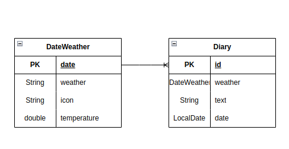
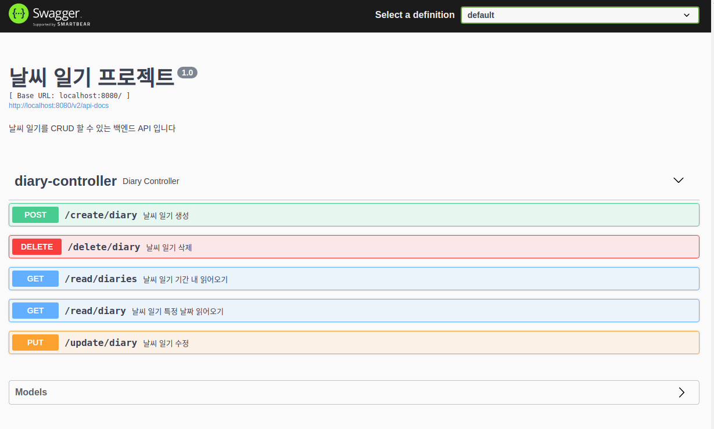

# Open API를 통해 받아온 날씨 정보를 이용해 일기 작성 백엔드 만드는 프로젝트 과제

## 기술
- Spring boot, Java
- Spring data jpa
- Mariadb
- logback

## 프로젝트 소개
- 일기를 작성/조회/수정/삭제 하는 프로젝트
- 일기에는 그날의 날씨가 포함되며 날씨는 Open Weather Map api를 이용해 얻어옴
- 날씨는 매일 새벽 1시에 API에서 받아다 DB에 저장

## Erd

## API
1. 일기 생성 : POST /create/diary
- 파라미터 : 날짜(date 형식 : yyyy-MM-dd), 일기 내용
- 외부 API 에서 받아온 날씨 데이터와 함께 DB에 저장
- 결과
- 성공 : 날짜, 날씨, 일기 내용
- 실패 : 날짜 형식이 잘못된 경우(INVALID_DATE_FORMAT), 일기 길이가 너무 긴 경우(TEXT_TOO_LONG)

2. 특정일 일기 가져오기 : GET /read/diary
- 파라미터 : 날짜(date 형식 : yyyy-MM-dd)
- 결과
- 성공 : 날짜, 날씨, 일기 내용을 List 형태로 반환
- 실패 : 날짜 형식이 잘못된 경우(INVALID_DATE_FORMAT), 일기가 없는 경우(DIARY_NOT_FOUND)

3. 특정 기간의 일기 가져오기 : GET /read/diaries
- 파라미터 : 조회 시작일(date 형식 : yyyy-MM-dd), 종료일(date 형식 : yyyy-MM-dd)
- 성공 : 날짜, 날씨, 일기 내용을 List 형태로 반환
- 실패 : 날짜 형식이 잘못된 경우(INVALID_DATE_FORMAT), 날짜 기간이 잘못된 경우(INVALID_DATE_PERIOD), 일기가 없는 경우(DIARY_NOT_FOUND)

4. 일기 수정 : PUT /update/diary
- 파라미터 : 날짜(date 형식 : yyyy-MM-dd), 일기 내용
- 해당 날짜의 첫번째 일기 글을 새로 받아온 일기글로 수정
- 성공 : 날짜, 날씨, 일기 내용
- 실패 : 해당 날짜에 일기가 없는 경우(DIARY_NOT_FOUND), 일기 길이가 너무 긴 경우(TEXT_TOO_LONG)

5. 일기 삭제 : DELETE /delete/diary
- 파라미터 : 날짜(date 형식 : yyyy-MM-dd)
- 해당 날짜의 모든 일기 삭제
- 성공 : 날짜
- 실패 : 날짜 형식이 잘못된 경우(INVALID_DATE_FORMAT), 해당 날짜에 일기가 없는 경우(DIARY_NOT_FOUND)

## 스케쥴링
- 매일 새벽 1시에 날씨 데이터를 openweathermap API에서 받아다 DB에 저장
- @Scheduled(cron = "0 0 1 * * *")

## API documentation

- swagger를 이용해 API document 작성
